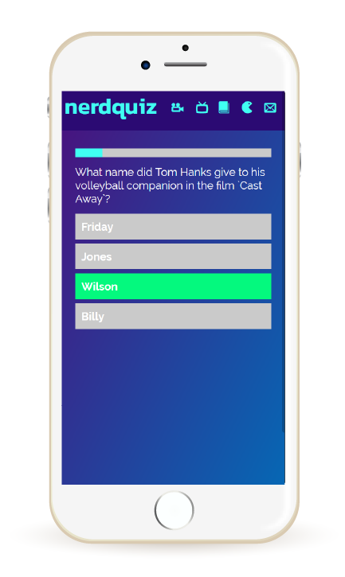

# nerdquiz

NerdQuiz é uma SPA (Single Page Application) de trívias sobre cultura pop.

**Página do projeto:** https://nerdquizapp.firebaseapp.com/

## Requisitos

1. Desenvolver uma Single Page Application com no mínimo 2 telas;
2. Uso de templates;
3. Uso de rotas;
4. Uso de pelo menos uma API.
5. Publicação no gh-pages ou firebase hosting.

## Ferramentas utilizadas

1. EcmaScript6;
2. Jquery;
3. API do Trivia Database;
4. Flexbox;
5. Responsividade

## Histórico

### Versão 1.0.0 - MVP

Primeira versão do projeto entregue em 04/10/2018. Nesta versão estão disponíveis as seguintes funcionalidades:

- Jogar um quiz de 5 perguntas nas categorias "Movies", "Tv", "Literature" e "Games"; :heavy_check_mark:
- Páginas "Home" e "Contato" implementadas; :heavy_check_mark: 
- Contador de tempo para responder às perguntas. As perguntas mudam automaticamente após 8 segundos; :heavy_check_mark: 
- Indicador visual das respostas corretas e erradas; :heavy_check_mark: 
- Pontuação do jogador ao final da trívia; :heavy_check_mark: 
- Design responsivo. :heavy_check_mark: 

**Problemas conhecidos:**

- Demora para fazer a requisição do quiz no banco de dados do Trivia Database. Com isso, às vezes o jogo não inicia ao apertar start. :heavy_exclamation_mark:
- Alguns problemas de sobreposição de elementos do layout em algumas resoluções de tela. :heavy_exclamation_mark:

## Versão 2.0.0 - TBA

Para a versão 2.0.0, desejo desenvolver as seguintes funcionalidades:

- Aumentar o tempo de resposta entre as perguntas;
- Trocar de pergunta assim que o usuário responde, não sendo necessário aguardar o tempo total do contador;
- Corrigir os problemas de layout em diferentes telas. 

## Versão 2.1.0 - TBA

Para a versão 2.1.0, desejo desenvolver as seguintes funcionalidades:

- Refatorar a SPA utilizando React + Redux;
- Implementar página de loading enquanto o site faz a requisição do quiz na API. 

## Versão 3.0.0 - TBA

Para a versão 3.0.0, desejo desenvolver as seguintes funcionalidades:

- Cadastro e login de usuários;
- Página com o histórico de partidas de cada usuário;
- Ranking global de todos os jogadores do site.
